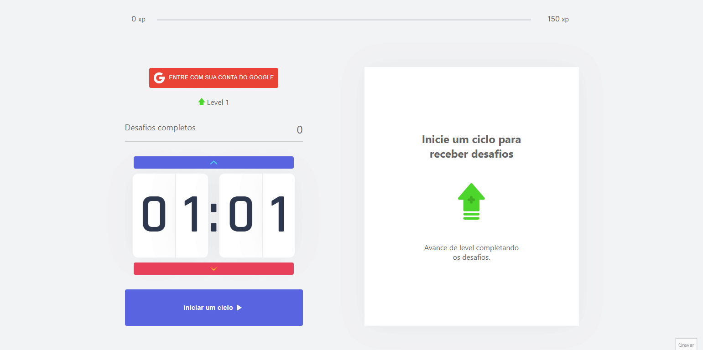
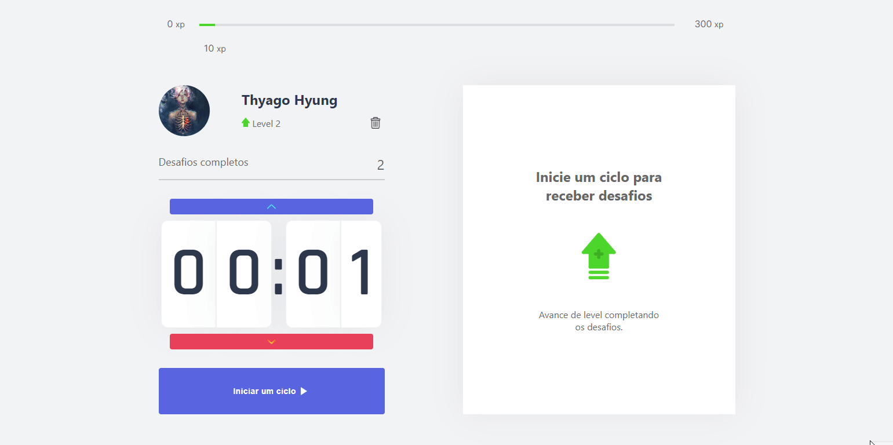

<p align="center">
  
</p>

<p align="center">
  
     
</p>

<h1 align="center">
    
    
</h1>

<br>

## 🧪 Tecnologias

Esse projeto foi desenvolvido com as seguintes tecnologias:

- [React](https://reactjs.org)
- [Firebase](https://firebase.google.com/)
- [TypeScript](https://www.typescriptlang.org/)
- [Material-UI](https://mui.com/pt/)

<br>

---

<br>

## 💻 Projeto

O move.it é um app que une a técnica de Pomodoro com a realização de exercícios físicos para quem passa muito tempo na frente do computador. Contando com um sistema de armazenamento local para caso não queria logar com o google, e um armazenamento na nuvem com firebase, utilizando a autenticação com o google.

Acesse a aplicação <a target="_blank" href="https://move-it-three-omega.vercel.app">aqui</a>.

<br>

---

<br>

## 📝 Funcionalidades

- Iniciar, abandonar o ciclo.
- Novos desafios a cada cilo terminado.
- Pode resetar progresso atual.
- Pode salvar progresso atual com login a conta do google.
- Armazenamento local caso não queria logar com o google.
- Definir o seu próprio tempo para cada ciclo.

<br/>

---

<br>

## 🚀 Como executar

Clone o projeto e acesse a pasta do mesmo.

```bash
$ git clone https://github.com/ThyagoAraujoM/Move-it.git
```

Para iniciá-lo, siga os passos abaixo:

```bash
# Instalar as dependências
$ yarn

# Iniciar o projeto
$ yarn start
```

Agora você pode acessar [`localhost:3000`](http://localhost:3000) do seu navegador.

---

<h2 id="--Contributing"> 🤝 Contribuindo </h2>

Este projeto é para fins de estudo.

Todos os tipos de contribuições são muito bem-vindos e apreciados!

⭐️ Iniciar o projeto
</br>
🐛 Encontrar e relatar problemas
</br>
📥 Envie PRs para ajudar a resolver problemas ou adicionar recursos

---

<h2 id="-autor">Autor</h2>

<a href="https://github.com/thyagoaraujom">
 
</br>
<p> Thyago Araujo <p>
</a>

[](https://www.linkedin.com/in/thyago-araujo-m/)
[](mailto:thyagoaraujomotta@gmail.com)

---

Feito com ❤️ por Thyago Araujo 👋🏽 [Entre em contato!](https://www.linkedin.com/in/thyago-araujo-m/)
